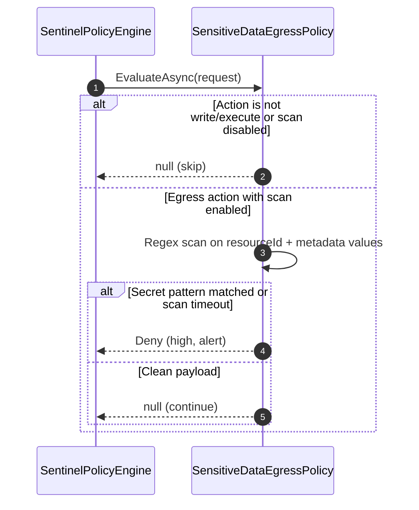

```mermaid
sequenceDiagram
    autonumber
    participant EN as SentinelPolicyEngine
    participant SE as SensitiveDataEgressPolicy

    EN->>SE: EvaluateAsync(request)
    alt Action is not write/execute or scan disabled
        SE-->>EN: null (skip)
    else Egress action with scan enabled
        SE->>SE: Regex scan on resourceId + metadata values
        alt Secret pattern matched or scan timeout
            SE-->>EN: Deny (high, alert)
        else Clean payload
            SE-->>EN: null (continue)
        end
    end
```
