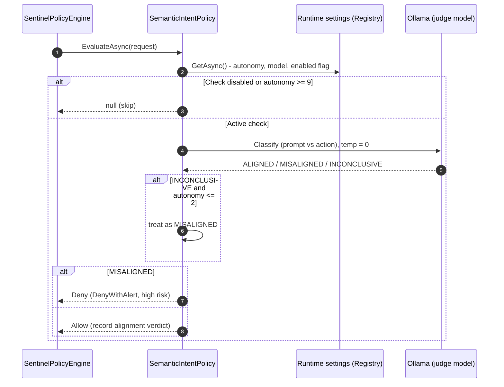

```mermaid
sequenceDiagram
    autonumber
    participant EN as SentinelPolicyEngine
    participant SI as SemanticIntentPolicy
    participant RS as Runtime settings (Registry)
    participant LLM as Ollama (judge model)

    EN->>SI: EvaluateAsync(request)
    SI->>RS: GetAsync() - autonomy, model, enabled flag
    alt Check disabled or autonomy >= 9
        SI-->>EN: null (skip)
    else Active check
        SI->>LLM: Classify (prompt vs action), temp = 0
        LLM-->>SI: ALIGNED / MISALIGNED / INCONCLUSIVE
        alt INCONCLUSIVE and autonomy <= 2
            SI->>SI: treat as MISALIGNED
        end
        alt MISALIGNED
            SI-->>EN: Deny (DenyWithAlert, high risk)
        else
            SI-->>EN: Allow (record alignment verdict)
        end
    end
```
