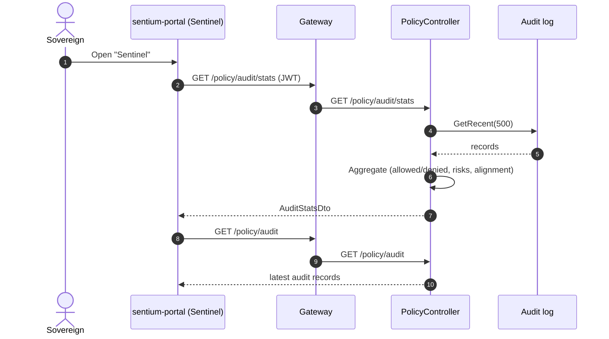

```mermaid
sequenceDiagram
    autonumber
    actor U as Sovereign
    participant FE as sentium-portal (Sentinel)
    participant GW as Gateway
    participant PC as PolicyController
    participant AU as Audit log

    U->>FE: Open "Sentinel"
    FE->>GW: GET /policy/audit/stats (JWT)
    GW->>PC: GET /policy/audit/stats
    PC->>AU: GetRecent(500)
    AU-->>PC: records
    PC->>PC: Aggregate (allowed/denied, risks, alignment)
    PC-->>FE: AuditStatsDto
    FE->>GW: GET /policy/audit
    GW->>PC: GET /policy/audit
    PC-->>FE: latest audit records
```
