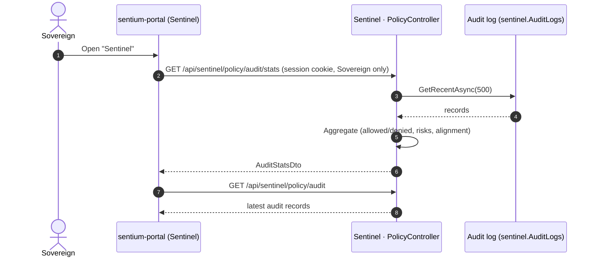

```mermaid
sequenceDiagram
    autonumber
    actor U as Sovereign
    participant FE as sentium-portal (Sentinel)
    participant PC as Sentinel · PolicyController
    participant AU as Audit log (sentinel.AuditLogs)

    U->>FE: Open "Sentinel"
    FE->>PC: GET /api/sentinel/policy/audit/stats (session cookie, Sovereign only)
    PC->>AU: GetRecentAsync(500)
    AU-->>PC: records
    PC->>PC: Aggregate (allowed/denied, risks, alignment)
    PC-->>FE: AuditStatsDto
    FE->>PC: GET /api/sentinel/policy/audit
    PC-->>FE: latest audit records
```
