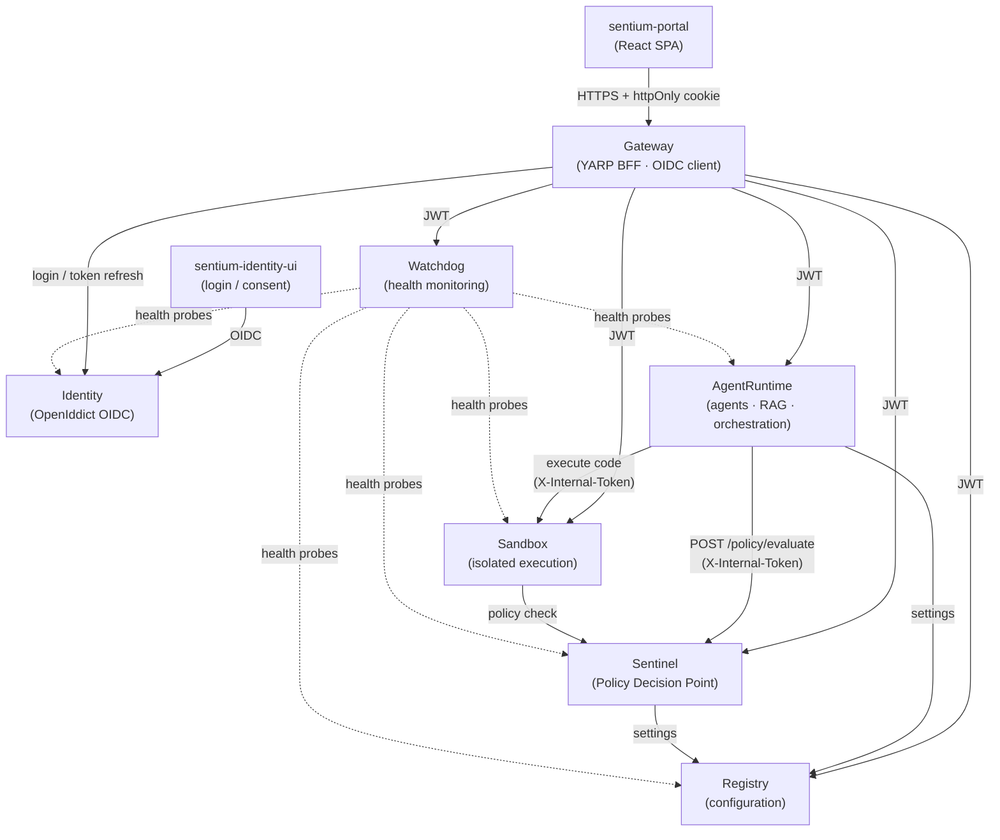

```mermaid
flowchart TB
    Portal["sentium-portal<br/>(React SPA)"]
    IdUI["sentium-identity-ui<br/>(login / consent)"]

    GW["Gateway<br/>(YARP BFF · OIDC client)"]

    ID["Identity<br/>(OpenIddict OIDC)"]
    REG["Registry<br/>(configuration)"]
    SEN["Sentinel<br/>(Policy Decision Point)"]
    AR["AgentRuntime<br/>(agents · RAG · orchestration)"]
    SBX["Sandbox<br/>(isolated execution)"]
    WD["Watchdog<br/>(health monitoring)"]

    Portal -->|"HTTPS + httpOnly cookie"| GW
    IdUI -->|"OIDC"| ID

    GW -->|"login / token refresh"| ID
    GW -->|"JWT"| REG
    GW -->|"JWT"| SEN
    GW -->|"JWT"| AR
    GW -->|"JWT"| SBX
    GW -->|"JWT"| WD

    AR -->|"POST /policy/evaluate<br/>(X-Internal-Token)"| SEN
    AR -->|"execute code<br/>(X-Internal-Token)"| SBX
    AR -->|"settings"| REG
    SBX -->|"policy check"| SEN
    SEN -->|"settings"| REG

    WD -.->|"health probes"| AR
    WD -.->|"health probes"| SEN
    WD -.->|"health probes"| SBX
    WD -.->|"health probes"| REG
    WD -.->|"health probes"| ID
```
