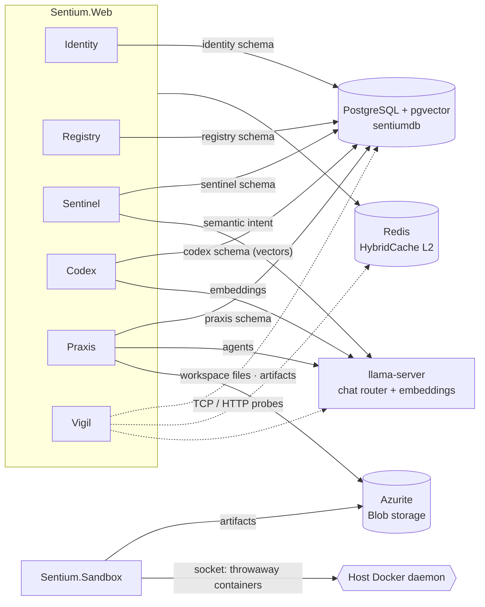

```mermaid
flowchart LR
    subgraph WEB["Sentium.Web"]
        ID["Identity"]
        REG["Registry"]
        SEN["Sentinel"]
        CDX["Codex"]
        PRX["Praxis"]
        VIG["Vigil"]
    end

    SBX["Sentium.Sandbox"]

    PG[("PostgreSQL + pgvector<br/>sentiumdb")]
    REDIS[("Redis<br/>HybridCache L2")]
    OLL["llama-server<br/>chat router + embeddings"]
    BLOB[("Azurite<br/>Blob storage")]
    DOCKER{{"Host Docker daemon"}}

    ID -->|"identity schema"| PG
    REG -->|"registry schema"| PG
    SEN -->|"sentinel schema"| PG
    CDX -->|"codex schema (vectors)"| PG
    PRX -->|"praxis schema"| PG

    WEB --> REDIS

    PRX -->|"agents"| OLL
    CDX -->|"embeddings"| OLL
    SEN -->|"semantic intent"| OLL
    PRX -->|"workspace files · artifacts"| BLOB

    SBX -->|"artifacts"| BLOB
    SBX -->|"socket: throwaway containers"| DOCKER

    VIG -.->|"TCP / HTTP probes"| PG
    VIG -.-> REDIS
    VIG -.-> OLL
```

Each module owns one schema with its own migrations history; there is no message broker - background
work runs on in-memory queues inside Sentium.Web.
