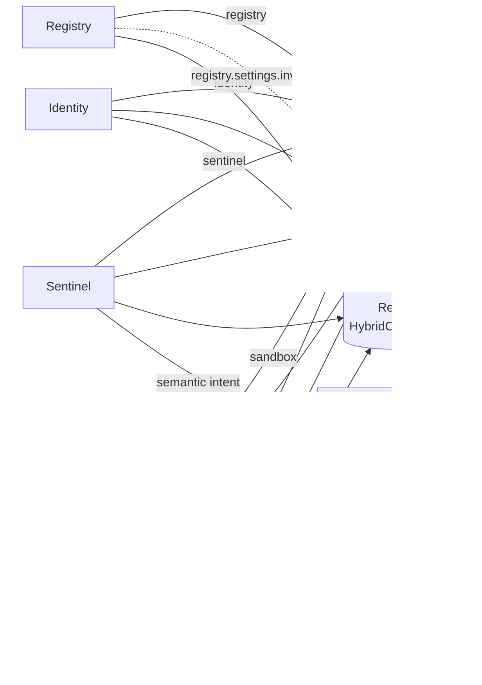

```mermaid
flowchart LR
    ID["Identity"]
    REG["Registry"]
    SEN["Sentinel"]
    AR["AgentRuntime"]
    SBX["Sandbox"]

    SQL[("SQL Server<br/>5 databases")]
    REDIS[("Redis<br/>HybridCache L2")]
    NATS{{"NATS JetStream"}}
    QDR[("Qdrant<br/>vectors")]
    OLL["Ollama<br/>LLM + embeddings"]
    BLOB[("Azurite<br/>Blob storage")]

    ID -->|"identity"| SQL
    REG -->|"registry"| SQL
    SEN -->|"sentinel"| SQL
    AR -->|"agentRuntime"| SQL
    SBX -->|"sandbox"| SQL

    REG -.->|"registry.settings.invalidated"| NATS
    AR -->|"workflow.* · stream.*"| NATS
    SBX --> NATS
    SEN --> NATS
    ID --> NATS

    REG --> REDIS
    AR --> REDIS
    SEN --> REDIS
    ID --> REDIS

    AR --> QDR
    AR --> OLL
    AR --> BLOB
    SBX --> BLOB
    SEN -->|"semantic intent"| OLL
```
