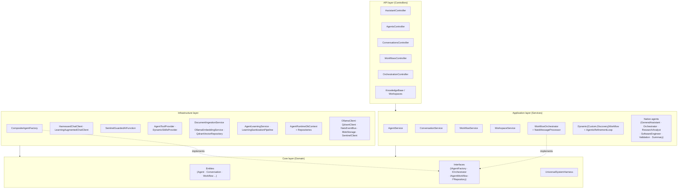

```mermaid
flowchart TB
    subgraph API["API layer (Controllers)"]
        AC["AssistantController"]
        AGC["AgentsController"]
        CC["ConversationsController"]
        WC["WorkflowsController"]
        OC["OrchestrationController"]
        KBC["KnowledgeBase / Workspaces"]
    end

    subgraph APP["Application layer (Services)"]
        AS["AgentService"]
        CS["ConversationService"]
        WS["WorkflowService"]
        WKS["WorkspaceService"]
        ORCH["WorkflowOrchestrator<br/>+ NatsMessageProcessor"]
        WF["Dynamic{Custom,Discovery}Workflow<br/>+ AgenticRefinementLoop"]
        NAT["Native agents<br/>(GeneralAssistant · Orchestrator · ResearchAnalyst<br/>· SoftwareEngineer · Validation · Summary)"]
    end

    subgraph CORE["Core layer (Domain)"]
        ENT["Entities<br/>(Agent · Conversation · Workflow ...)"]
        IFACE["Interfaces<br/>(IAgentFactory · IOrchestrator<br/>· IAgentWorkflow · I*Repository)"]
        HAR["UniversalSystemHarness"]
    end

    subgraph INFRA["Infrastructure layer"]
        CAF["CompositeAgentFactory"]
        DEC["HarnessedChatClient ·<br/>LearningAugmentedChatClient"]
        SG["SentinelGuardedAIFunction"]
        TP["AgentToolProvider ·<br/>DynamicSkillsProvider"]
        RAG["DocumentIngestionService ·<br/>OllamaEmbeddingService ·<br/>QdrantVectorRepository"]
        LRN["AgentLearningService ·<br/>LearningSanitizationPipeline"]
        DB["AgentRuntimeDbContext<br/>+ Repositories"]
        EXT["OllamaClient · QdrantClient ·<br/>NatsEventBus · BlobStorage ·<br/>SentinelClient"]
    end

    API --> APP
    APP --> CORE
    INFRA --> CORE
    CAF -. implements .-> IFACE
    ORCH -. implements .-> IFACE
```
