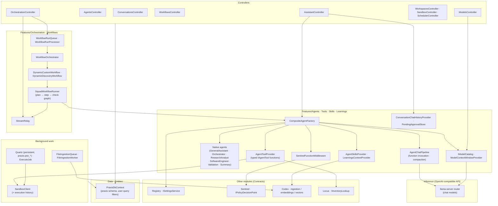

```mermaid
flowchart TB
    subgraph API["Controllers"]
        AC["AssistantController"]
        AGC["AgentsController"]
        CC["ConversationsController"]
        WC["WorkflowsController"]
        OC["OrchestrationController"]
        WSC["WorkspacesController · SandboxController · SchedulerController"]
        MOC["ModelsController"]
    end

    subgraph AGENTS["Features/Agents · Tools · Skills · Learnings"]
        CAF["CompositeAgentFactory"]
        PIPE["AgentChatPipeline<br/>(function invocation · compaction)"]
        NAT["Native agents<br/>(GeneralAssistant · Orchestrator · ResearchAnalyst<br/>· SoftwareEngineer · Validation · Summary)"]
        TP["AgentToolProvider<br/>(typed IAgentTool functions)"]
        CTX["AgentSkillsProvider ·<br/>LearningsContextProvider"]
        SFM["SentinelFunctionMiddleware"]
        CHP["ConversationChatHistoryProvider ·<br/>PendingApprovalStore"]
        MOD["IModelCatalog ·<br/>ModelContextWindowProvider"]
    end

    subgraph ORCH["Features/Orchestration · Workflows"]
        Q["WorkflowRunQueue ·<br/>WorkflowRunProcessor"]
        WO["WorkflowOrchestrator"]
        WF["DynamicCustomWorkflow ·<br/>DynamicDiscoveryWorkflow"]
        SQ["SquadWorkflowRunner<br/>(plan → step → check graph)"]
        SR["StreamRelay"]
    end

    subgraph BG["Background work"]
        FIW["FileIngestionQueue ·<br/>FileIngestionWorker"]
        QZ["Quartz (persistent, praxis.qrtz_*) ·<br/>ExecuteJob"]
        SBC["SandboxClient<br/>(+ execution history)"]
    end

    subgraph DATA["Data · Entities"]
        DB["PraxisDbContext<br/>(praxis schema, user query filters)"]
    end

    subgraph EXT["Other modules (Contracts)"]
        RC["Registry · ISettingsService"]
        PDP["Sentinel · IPolicyDecisionPoint"]
        CX["Codex · ingestion / embeddings / vectors"]
        LOC["Locus · IInventoryLookup"]
    end

    subgraph INF["Inference (OpenAI-compatible API)"]
        LLM["llama-server router<br/>(chat models)"]
    end

    AC --> CAF
    AC --> CHP
    OC --> Q
    OC --> SR
    Q --> WO --> WF --> SQ
    SQ --> CAF
    SQ --> SR
    CAF --> PIPE
    CAF --> MOD
    PIPE --> LLM
    MOC --> MOD
    MOD --> LLM
    CAF --> NAT
    CAF --> TP
    CAF --> CTX
    CAF --> SFM
    CAF --> RC
    SFM --> PDP
    CTX --> CX
    FIW --> CX
    TP --> SBC
    TP --> LOC
    QZ --> SBC
    API --> DB
    BG --> DB
```
