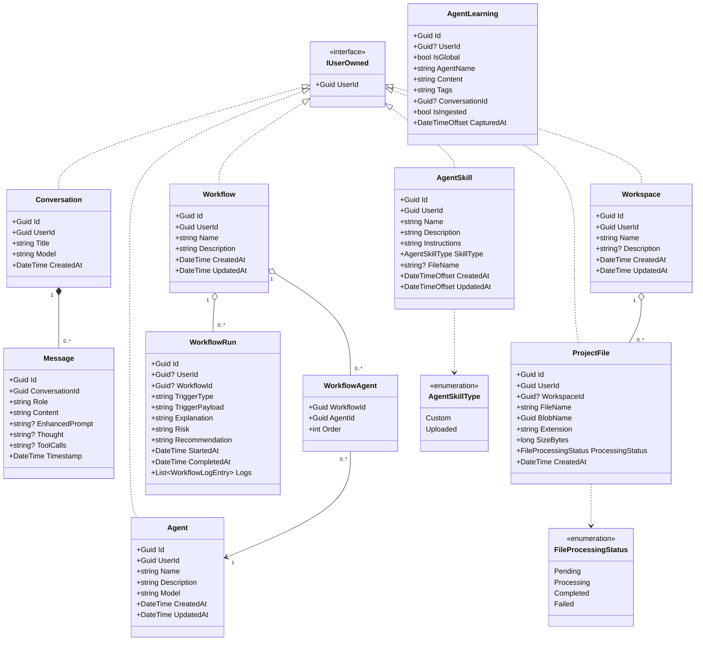

```mermaid
classDiagram
    class IUserOwned {
        <<interface>>
        +Guid UserId
    }

    class Agent {
        +Guid Id
        +Guid UserId
        +string Name
        +string Description
        +string Model
        +DateTime CreatedAt
        +DateTime UpdatedAt
    }

    class Conversation {
        +Guid Id
        +Guid UserId
        +string Title
        +string Model
        +DateTime CreatedAt
    }

    class Message {
        +Guid Id
        +Guid ConversationId
        +string Role
        +string Content
        +string? EnhancedPrompt
        +string? Thought
        +string? ToolCalls
        +DateTime Timestamp
    }

    class Workflow {
        +Guid Id
        +Guid UserId
        +string Name
        +string Description
        +DateTime CreatedAt
        +DateTime UpdatedAt
    }

    class WorkflowAgent {
        +Guid WorkflowId
        +Guid AgentId
        +int Order
    }

    class WorkflowRun {
        +Guid Id
        +Guid? UserId
        +Guid? WorkflowId
        +string TriggerType
        +string TriggerPayload
        +string Explanation
        +string Risk
        +string Recommendation
        +DateTime StartedAt
        +DateTime CompletedAt
        +List~WorkflowLogEntry~ Logs
    }

    class AgentSkill {
        +Guid Id
        +Guid UserId
        +string Name
        +string Description
        +string Instructions
        +AgentSkillType SkillType
        +string? FileName
        +DateTimeOffset CreatedAt
        +DateTimeOffset UpdatedAt
    }

    class AgentLearning {
        +Guid Id
        +Guid? UserId
        +bool IsGlobal
        +string AgentName
        +string Content
        +string Tags
        +Guid? ConversationId
        +bool IsIngested
        +DateTimeOffset CapturedAt
    }

    class Workspace {
        +Guid Id
        +Guid UserId
        +string Name
        +string? Description
        +DateTime CreatedAt
        +DateTime UpdatedAt
    }

    class ProjectFile {
        +Guid Id
        +Guid UserId
        +Guid? WorkspaceId
        +string FileName
        +Guid BlobName
        +string Extension
        +long SizeBytes
        +FileProcessingStatus ProcessingStatus
        +DateTime CreatedAt
    }

    class AgentSkillType {
        <<enumeration>>
        Custom
        Uploaded
    }
    class FileProcessingStatus {
        <<enumeration>>
        Pending
        Processing
        Completed
        Failed
    }

    IUserOwned <|.. Agent
    IUserOwned <|.. Conversation
    IUserOwned <|.. Workflow
    IUserOwned <|.. AgentSkill
    IUserOwned <|.. Workspace
    IUserOwned <|.. ProjectFile

    Conversation "1" *-- "0..*" Message
    Workflow "1" o-- "0..*" WorkflowAgent
    WorkflowAgent "0..*" --> "1" Agent
    Workflow "1" o-- "0..*" WorkflowRun
    Workspace "1" o-- "0..*" ProjectFile
    AgentSkill ..> AgentSkillType
    ProjectFile ..> FileProcessingStatus
```
