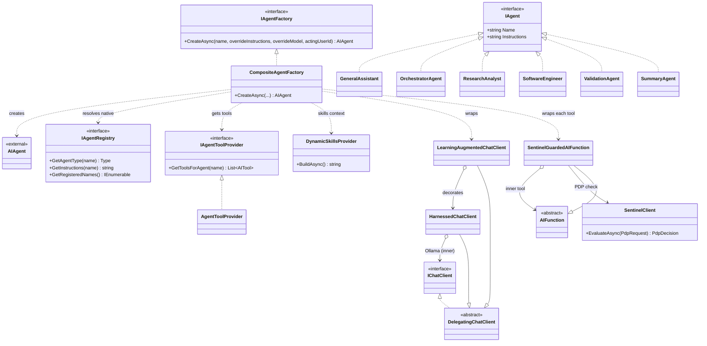

```mermaid
classDiagram
    class IAgentFactory {
        <<interface>>
        +CreateAsync(name, overrideInstructions, overrideModel, actingUserId) AIAgent
    }
    class CompositeAgentFactory {
        +CreateAsync(...) AIAgent
    }

    class IAgent {
        <<interface>>
        +string Name
        +string Instructions
    }
    class GeneralAssistant
    class OrchestratorAgent
    class ResearchAnalyst
    class SoftwareEngineer
    class ValidationAgent
    class SummaryAgent

    class IAgentRegistry {
        <<interface>>
        +GetAgentType(name) Type
        +GetInstructions(name) string
        +GetRegisteredNames() IEnumerable
    }
    class IAgentToolProvider {
        <<interface>>
        +GetToolsForAgent(name) List~AITool~
    }
    class DynamicSkillsProvider {
        +BuildAsync() string
    }

    class IChatClient {
        <<interface>>
    }
    class DelegatingChatClient {
        <<abstract>>
    }
    class HarnessedChatClient
    class LearningAugmentedChatClient

    class AIFunction {
        <<abstract>>
    }
    class SentinelGuardedAIFunction
    class SentinelClient {
        +EvaluateAsync(PdpRequest) PdpDecision
    }
    class AIAgent {
        <<external>>
    }

    IAgentFactory <|.. CompositeAgentFactory
    IAgent <|.. GeneralAssistant
    IAgent <|.. OrchestratorAgent
    IAgent <|.. ResearchAnalyst
    IAgent <|.. SoftwareEngineer
    IAgent <|.. ValidationAgent
    IAgent <|.. SummaryAgent
    IAgentToolProvider <|.. AgentToolProvider

    IChatClient <|.. DelegatingChatClient
    DelegatingChatClient <|-- HarnessedChatClient
    DelegatingChatClient <|-- LearningAugmentedChatClient
    AIFunction <|-- SentinelGuardedAIFunction

    CompositeAgentFactory ..> AIAgent : creates
    CompositeAgentFactory ..> IAgentRegistry : resolves native
    CompositeAgentFactory ..> IAgentToolProvider : gets tools
    CompositeAgentFactory ..> DynamicSkillsProvider : skills context
    CompositeAgentFactory ..> LearningAugmentedChatClient : wraps
    CompositeAgentFactory ..> SentinelGuardedAIFunction : wraps each tool

    LearningAugmentedChatClient o--> HarnessedChatClient : decorates
    HarnessedChatClient o--> IChatClient : Ollama (inner)
    SentinelGuardedAIFunction o--> AIFunction : inner tool
    SentinelGuardedAIFunction --> SentinelClient : PDP check
```
