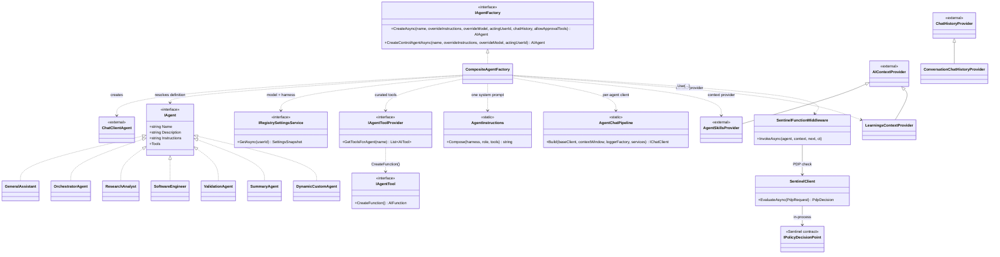

```mermaid
classDiagram
    class IAgentFactory {
        <<interface>>
        +CreateAsync(name, overrideInstructions, overrideModel, actingUserId, chatHistory, allowApprovalTools) AIAgent
        +CreateControlAgentAsync(name, overrideInstructions, overrideModel, actingUserId) AIAgent
    }
    class CompositeAgentFactory

    class IAgent {
        <<interface>>
        +string Name
        +string Description
        +string Instructions
        +Tools
    }
    class GeneralAssistant
    class OrchestratorAgent
    class ResearchAnalyst
    class SoftwareEngineer
    class ValidationAgent
    class SummaryAgent
    class DynamicCustomAgent

    class IAgentToolProvider {
        <<interface>>
        +GetToolsForAgent(name) List~AITool~
    }
    class IAgentTool {
        <<interface>>
        +CreateFunction() AIFunction
    }
    class AgentInstructions {
        <<static>>
        +Compose(harness, role, tools) string
    }
    class AgentChatPipeline {
        <<static>>
        +Build(baseClient, contextWindow, loggerFactory, services) IChatClient
    }

    class AIContextProvider {
        <<external>>
    }
    class AgentSkillsProvider {
        <<external>>
    }
    class LearningsContextProvider
    class ChatHistoryProvider {
        <<external>>
    }
    class ConversationChatHistoryProvider

    class SentinelFunctionMiddleware {
        +InvokeAsync(agent, context, next, ct)
    }
    class SentinelClient {
        +EvaluateAsync(PdpRequest) PdpDecision
    }
    class IPolicyDecisionPoint {
        <<Sentinel contract>>
    }
    class IRegistrySettingsService {
        <<interface>>
        +GetAsync(userId) SettingsSnapshot
    }
    class ChatClientAgent {
        <<external>>
    }

    IAgentFactory <|.. CompositeAgentFactory
    IAgent <|.. GeneralAssistant
    IAgent <|.. OrchestratorAgent
    IAgent <|.. ResearchAnalyst
    IAgent <|.. SoftwareEngineer
    IAgent <|.. ValidationAgent
    IAgent <|.. SummaryAgent
    IAgent <|.. DynamicCustomAgent
    AIContextProvider <|-- AgentSkillsProvider
    AIContextProvider <|-- LearningsContextProvider
    ChatHistoryProvider <|-- ConversationChatHistoryProvider

    CompositeAgentFactory ..> ChatClientAgent : creates
    CompositeAgentFactory ..> IAgent : resolves definition
    CompositeAgentFactory ..> IRegistrySettingsService : model + harness
    CompositeAgentFactory ..> IAgentToolProvider : curated tools
    CompositeAgentFactory ..> AgentInstructions : one system prompt
    CompositeAgentFactory ..> AgentChatPipeline : per-agent client
    CompositeAgentFactory ..> AgentSkillsProvider : context provider
    CompositeAgentFactory ..> LearningsContextProvider : context provider
    CompositeAgentFactory ..> SentinelFunctionMiddleware : .Use(...)
    IAgentToolProvider ..> IAgentTool : CreateFunction()
    SentinelFunctionMiddleware --> SentinelClient : PDP check
    SentinelClient --> IPolicyDecisionPoint : in-process
```
