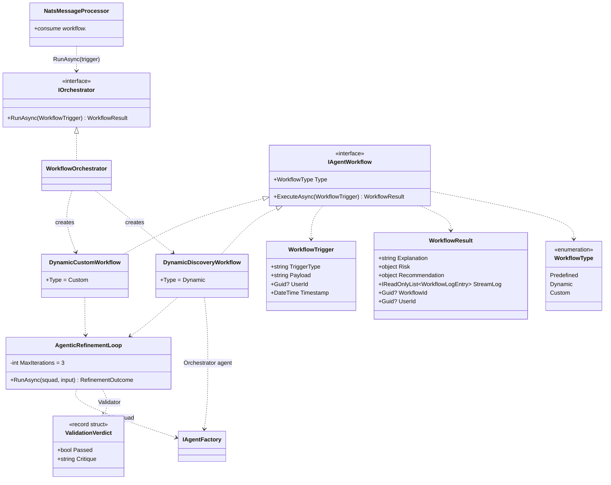

```mermaid
classDiagram
    class IOrchestrator {
        <<interface>>
        +RunAsync(WorkflowTrigger) WorkflowResult
    }
    class WorkflowOrchestrator

    class IAgentWorkflow {
        <<interface>>
        +WorkflowType Type
        +ExecuteAsync(WorkflowTrigger) WorkflowResult
    }
    class DynamicCustomWorkflow {
        +Type = Custom
    }
    class DynamicDiscoveryWorkflow {
        +Type = Dynamic
    }

    class AgenticRefinementLoop {
        -int MaxIterations = 3
        +RunAsync(squad, input) RefinementOutcome
    }
    class NatsMessageProcessor {
        +consume workflow.*
    }

    class WorkflowTrigger {
        +string TriggerType
        +string Payload
        +Guid? UserId
        +DateTime Timestamp
    }
    class WorkflowResult {
        +string Explanation
        +object Risk
        +object Recommendation
        +IReadOnlyList~WorkflowLogEntry~ StreamLog
        +Guid? WorkflowId
        +Guid? UserId
    }
    class ValidationVerdict {
        <<record struct>>
        +bool Passed
        +string Critique
    }
    class WorkflowType {
        <<enumeration>>
        Predefined
        Dynamic
        Custom
    }

    IOrchestrator <|.. WorkflowOrchestrator
    IAgentWorkflow <|.. DynamicCustomWorkflow
    IAgentWorkflow <|.. DynamicDiscoveryWorkflow

    NatsMessageProcessor ..> IOrchestrator : RunAsync(trigger)
    WorkflowOrchestrator ..> DynamicCustomWorkflow : creates
    WorkflowOrchestrator ..> DynamicDiscoveryWorkflow : creates
    DynamicCustomWorkflow ..> AgenticRefinementLoop
    DynamicDiscoveryWorkflow ..> AgenticRefinementLoop
    AgenticRefinementLoop ..> IAgentFactory : builds squad
    DynamicDiscoveryWorkflow ..> IAgentFactory : Orchestrator agent
    AgenticRefinementLoop ..> ValidationVerdict : Validator
    IAgentWorkflow ..> WorkflowTrigger
    IAgentWorkflow ..> WorkflowResult
    IAgentWorkflow ..> WorkflowType
```
