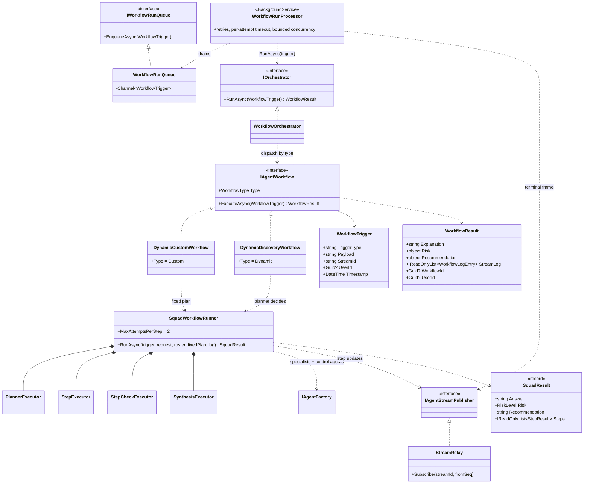

```mermaid
classDiagram
    class IWorkflowRunQueue {
        <<interface>>
        +EnqueueAsync(WorkflowTrigger)
    }
    class WorkflowRunQueue {
        -Channel~WorkflowTrigger~
    }
    class WorkflowRunProcessor {
        <<BackgroundService>>
        +retries, per-attempt timeout, bounded concurrency
    }
    class IOrchestrator {
        <<interface>>
        +RunAsync(WorkflowTrigger) WorkflowResult
    }
    class WorkflowOrchestrator

    class IAgentWorkflow {
        <<interface>>
        +WorkflowType Type
        +ExecuteAsync(WorkflowTrigger) WorkflowResult
    }
    class DynamicCustomWorkflow {
        +Type = Custom
    }
    class DynamicDiscoveryWorkflow {
        +Type = Dynamic
    }

    class SquadWorkflowRunner {
        +MaxAttemptsPerStep = 2
        +RunAsync(trigger, request, roster, fixedPlan, log) SquadResult
    }
    class PlannerExecutor
    class StepExecutor
    class StepCheckExecutor
    class SynthesisExecutor

    class IAgentStreamPublisher {
        <<interface>>
    }
    class StreamRelay {
        +Subscribe(streamId, fromSeq)
    }

    class WorkflowTrigger {
        +string TriggerType
        +string Payload
        +string StreamId
        +Guid? UserId
        +DateTime Timestamp
    }
    class WorkflowResult {
        +string Explanation
        +object Risk
        +object Recommendation
        +IReadOnlyList~WorkflowLogEntry~ StreamLog
        +Guid? WorkflowId
        +Guid? UserId
    }
    class SquadResult {
        <<record>>
        +string Answer
        +RiskLevel Risk
        +string Recommendation
        +IReadOnlyList~StepResult~ Steps
    }

    IWorkflowRunQueue <|.. WorkflowRunQueue
    IOrchestrator <|.. WorkflowOrchestrator
    IAgentWorkflow <|.. DynamicCustomWorkflow
    IAgentWorkflow <|.. DynamicDiscoveryWorkflow
    IAgentStreamPublisher <|.. StreamRelay

    WorkflowRunProcessor ..> WorkflowRunQueue : drains
    WorkflowRunProcessor ..> IOrchestrator : RunAsync(trigger)
    WorkflowRunProcessor ..> IAgentStreamPublisher : terminal frame
    WorkflowOrchestrator ..> IAgentWorkflow : dispatch by type
    DynamicCustomWorkflow ..> SquadWorkflowRunner : fixed plan
    DynamicDiscoveryWorkflow ..> SquadWorkflowRunner : planner decides
    SquadWorkflowRunner *-- PlannerExecutor
    SquadWorkflowRunner *-- StepExecutor
    SquadWorkflowRunner *-- StepCheckExecutor
    SquadWorkflowRunner *-- SynthesisExecutor
    SquadWorkflowRunner ..> IAgentFactory : specialists + control agents
    SquadWorkflowRunner ..> IAgentStreamPublisher : step updates
    SquadWorkflowRunner ..> SquadResult
    IAgentWorkflow ..> WorkflowTrigger
    IAgentWorkflow ..> WorkflowResult
```
