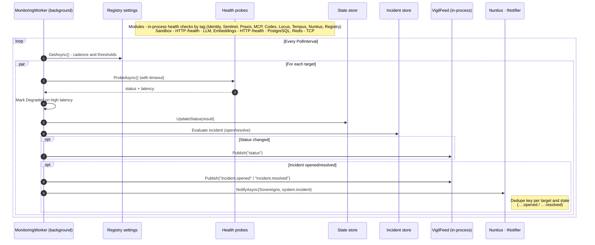

```mermaid
sequenceDiagram
    autonumber
    participant MW as MonitoringWorker (background)
    participant RS as Registry settings
    participant PR as Health probes
    participant ST as State store
    participant IN as Incident store
    participant FD as VigilFeed (in-process)
    participant NT as Nuntius · INotifier

    Note over PR: Modules - in-process health checks by tag (Identity, Sentinel, Praxis, MCP, Codex, Locus, Tempus, Nuntius, Registry)<br/>Sandbox - HTTP /health · LLM, Embeddings - HTTP /health · PostgreSQL, Redis - TCP
    loop Every PollInterval
        MW->>RS: GetAsync() - cadence and thresholds
        par For each target
            MW->>PR: ProbeAsync() (with timeout)
            PR-->>MW: status + latency
            MW->>MW: Mark Degraded on high latency
            MW->>ST: UpdateStatus(result)
            MW->>IN: Evaluate incident (open/resolve)
            opt Status changed
                MW->>FD: Publish("status")
            end
            opt Incident opened/resolved
                MW->>FD: Publish("incident.opened" / "incident.resolved")
                MW->>NT: NotifyAsync(Sovereigns, system.incident)
                Note right of NT: Dedupe key per target and state<br/>(…:opened / …:resolved)
            end
        end
    end
```
