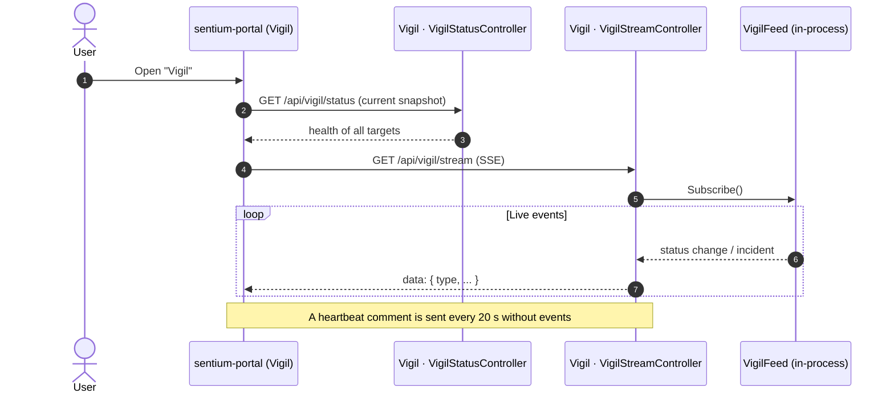

```mermaid
sequenceDiagram
    autonumber
    actor U as User
    participant FE as sentium-portal (Vigil)
    participant WS as Vigil · VigilStatusController
    participant WSC as Vigil · VigilStreamController
    participant FD as VigilFeed (in-process)

    U->>FE: Open "Vigil"
    FE->>WS: GET /api/vigil/status (current snapshot)
    WS-->>FE: health of all targets
    FE->>WSC: GET /api/vigil/stream (SSE)
    WSC->>FD: Subscribe()
    loop Live events
        FD-->>WSC: status change / incident
        WSC-->>FE: data: { type, ... }
    end
    Note over WSC,FE: A heartbeat comment is sent every 20 s without events
```
