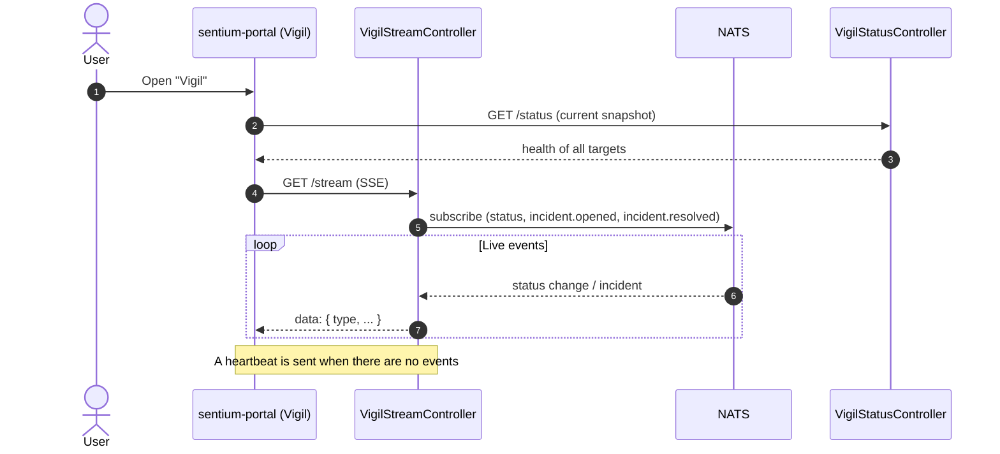

```mermaid
sequenceDiagram
    autonumber
    actor U as User
    participant FE as sentium-portal (Vigil)
    participant WSC as VigilStreamController
    participant NATS as NATS
    participant WS as VigilStatusController

    U->>FE: Open "Vigil"
    FE->>WS: GET /status (current snapshot)
    WS-->>FE: health of all targets
    FE->>WSC: GET /stream (SSE)
    WSC->>NATS: subscribe (status, incident.opened, incident.resolved)
    loop Live events
        NATS-->>WSC: status change / incident
        WSC-->>FE: data: { type, ... }
    end
    Note over WSC,FE: A heartbeat is sent when there are no events
```
