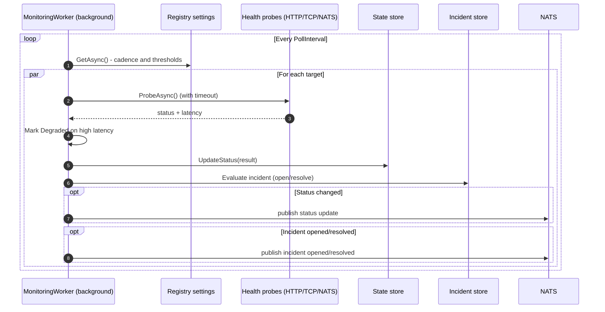

```mermaid
sequenceDiagram
    autonumber
    participant MW as MonitoringWorker (background)
    participant RS as Registry settings
    participant PR as Health probes (HTTP/TCP/NATS)
    participant ST as State store
    participant IN as Incident store
    participant NATS as NATS

    loop Every PollInterval
        MW->>RS: GetAsync() - cadence and thresholds
        par For each target
            MW->>PR: ProbeAsync() (with timeout)
            PR-->>MW: status + latency
            MW->>MW: Mark Degraded on high latency
            MW->>ST: UpdateStatus(result)
            MW->>IN: Evaluate incident (open/resolve)
            opt Status changed
                MW->>NATS: publish status update
            end
            opt Incident opened/resolved
                MW->>NATS: publish incident opened/resolved
            end
        end
    end
```
