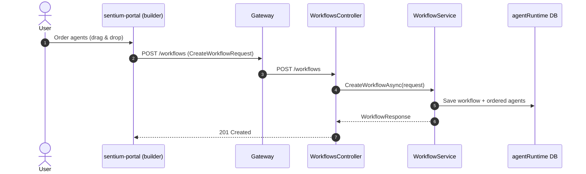

```mermaid
sequenceDiagram
    autonumber
    actor U as User
    participant FE as sentium-portal (builder)
    participant GW as Gateway
    participant AR as WorkflowsController
    participant WS as WorkflowService
    participant DB as agentRuntime DB

    U->>FE: Order agents (drag & drop)
    FE->>GW: POST /workflows (CreateWorkflowRequest)
    GW->>AR: POST /workflows
    AR->>WS: CreateWorkflowAsync(request)
    WS->>DB: Save workflow + ordered agents
    WS-->>AR: WorkflowResponse
    AR-->>FE: 201 Created
```
