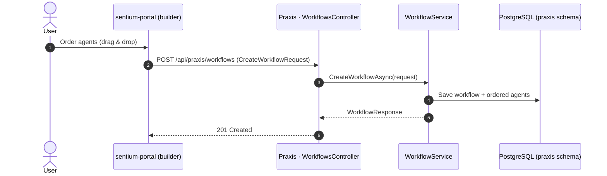

```mermaid
sequenceDiagram
    autonumber
    actor U as User
    participant FE as sentium-portal (builder)
    participant WC as Praxis · WorkflowsController
    participant WS as WorkflowService
    participant DB as PostgreSQL (praxis schema)

    U->>FE: Order agents (drag & drop)
    FE->>WC: POST /api/praxis/workflows (CreateWorkflowRequest)
    WC->>WS: CreateWorkflowAsync(request)
    WS->>DB: Save workflow + ordered agents
    WS-->>WC: WorkflowResponse
    WC-->>FE: 201 Created
```
