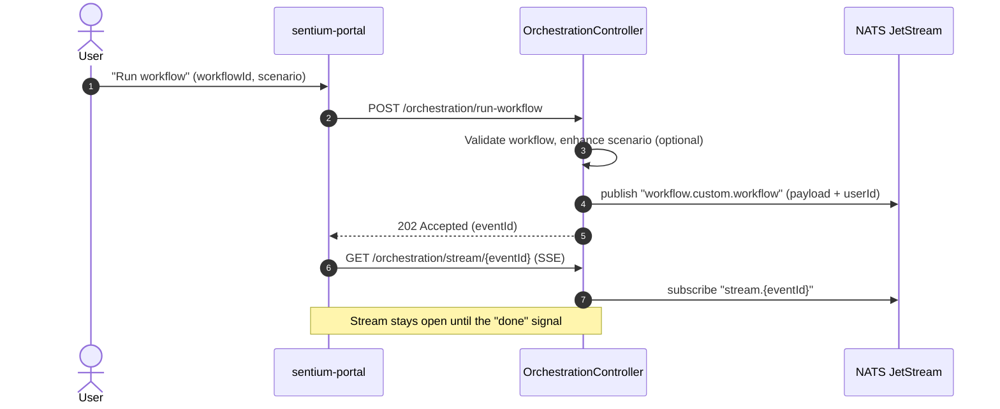

```mermaid
sequenceDiagram
    autonumber
    actor U as User
    participant FE as sentium-portal
    participant OC as OrchestrationController
    participant NATS as NATS JetStream

    U->>FE: "Run workflow" (workflowId, scenario)
    FE->>OC: POST /orchestration/run-workflow
    OC->>OC: Validate workflow, enhance scenario (optional)
    OC->>NATS: publish "workflow.custom.workflow" (payload + userId)
    OC-->>FE: 202 Accepted (eventId)
    FE->>OC: GET /orchestration/stream/{eventId} (SSE)
    OC->>NATS: subscribe "stream.{eventId}"
    Note over OC,FE: Stream stays open until the "done" signal
```
