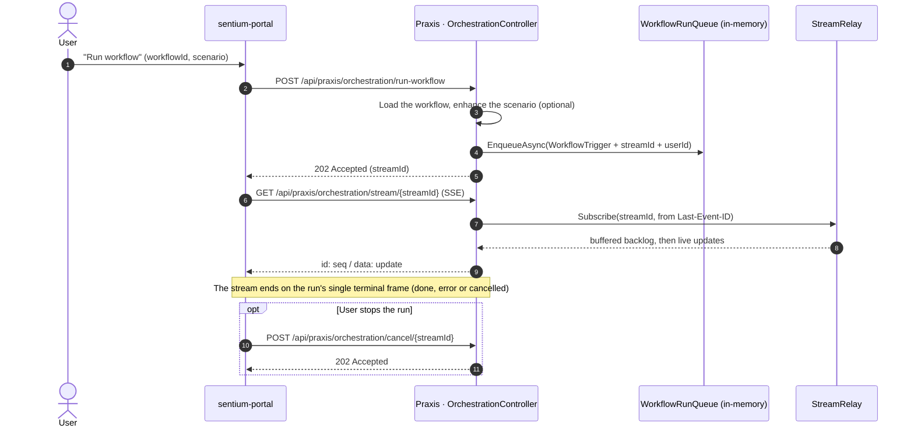

```mermaid
sequenceDiagram
    autonumber
    actor U as User
    participant FE as sentium-portal
    participant OC as Praxis · OrchestrationController
    participant Q as WorkflowRunQueue (in-memory)
    participant SR as StreamRelay

    U->>FE: "Run workflow" (workflowId, scenario)
    FE->>OC: POST /api/praxis/orchestration/run-workflow
    OC->>OC: Load the workflow, enhance the scenario (optional)
    OC->>Q: EnqueueAsync(WorkflowTrigger + streamId + userId)
    OC-->>FE: 202 Accepted (streamId)
    FE->>OC: GET /api/praxis/orchestration/stream/{streamId} (SSE)
    OC->>SR: Subscribe(streamId, from Last-Event-ID)
    SR-->>OC: buffered backlog, then live updates
    OC-->>FE: id: seq / data: update
    Note over OC,FE: The stream ends on the run's single terminal frame (done, error or cancelled)
    opt User stops the run
        FE->>OC: POST /api/praxis/orchestration/cancel/{streamId}
        OC-->>FE: 202 Accepted
    end
```
