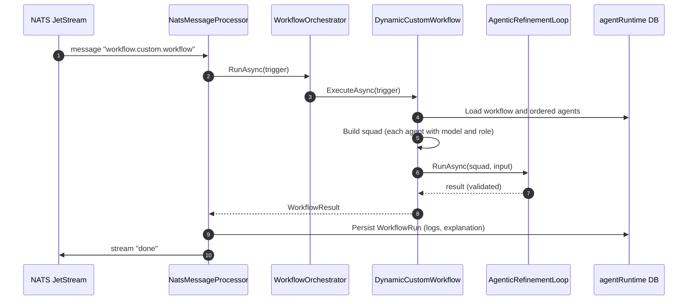

```mermaid
sequenceDiagram
    autonumber
    participant NATS as NATS JetStream
    participant MP as NatsMessageProcessor
    participant OR as WorkflowOrchestrator
    participant CW as DynamicCustomWorkflow
    participant RL as AgenticRefinementLoop
    participant DB as agentRuntime DB

    NATS->>MP: message "workflow.custom.workflow"
    MP->>OR: RunAsync(trigger)
    OR->>CW: ExecuteAsync(trigger)
    CW->>DB: Load workflow and ordered agents
    CW->>CW: Build squad (each agent with model and role)
    CW->>RL: RunAsync(squad, input)
    RL-->>CW: result (validated)
    CW-->>MP: WorkflowResult
    MP->>DB: Persist WorkflowRun (logs, explanation)
    MP->>NATS: stream "done"
```
