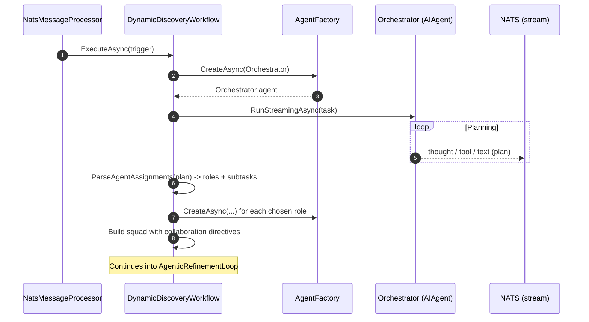

```mermaid
sequenceDiagram
    autonumber
    participant MP as NatsMessageProcessor
    participant DW as DynamicDiscoveryWorkflow
    participant F as AgentFactory
    participant OA as Orchestrator (AIAgent)
    participant NATS as NATS (stream)

    MP->>DW: ExecuteAsync(trigger)
    DW->>F: CreateAsync(Orchestrator)
    F-->>DW: Orchestrator agent
    DW->>OA: RunStreamingAsync(task)
    loop Planning
        OA-->>NATS: thought / tool / text (plan)
    end
    DW->>DW: ParseAgentAssignments(plan) -> roles + subtasks
    DW->>F: CreateAsync(...) for each chosen role
    DW->>DW: Build squad with collaboration directives
    Note over DW: Continues into AgenticRefinementLoop
```
