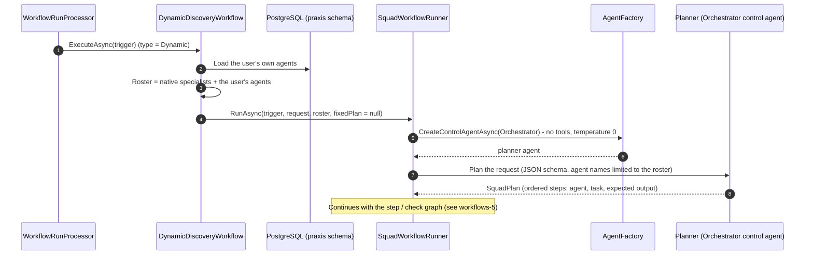

```mermaid
sequenceDiagram
    autonumber
    participant RP as WorkflowRunProcessor
    participant DW as DynamicDiscoveryWorkflow
    participant DB as PostgreSQL (praxis schema)
    participant SQ as SquadWorkflowRunner
    participant F as AgentFactory
    participant PL as Planner (Orchestrator control agent)

    RP->>DW: ExecuteAsync(trigger) (type = Dynamic)
    DW->>DB: Load the user's own agents
    DW->>DW: Roster = native specialists + the user's agents
    DW->>SQ: RunAsync(trigger, request, roster, fixedPlan = null)
    SQ->>F: CreateControlAgentAsync(Orchestrator) - no tools, temperature 0
    F-->>SQ: planner agent
    SQ->>PL: Plan the request (JSON schema, agent names limited to the roster)
    PL-->>SQ: SquadPlan (ordered steps: agent, task, expected output)
    Note over SQ: Continues with the step / check graph (see workflows-5)
```
