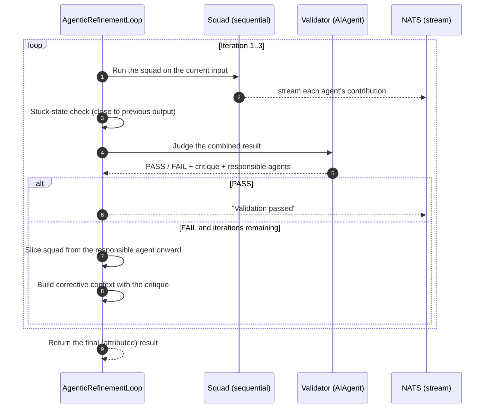

```mermaid
sequenceDiagram
    autonumber
    participant RL as AgenticRefinementLoop
    participant SQ as Squad (sequential)
    participant VA as Validator (AIAgent)
    participant NATS as NATS (stream)

    loop Iteration 1..3
        RL->>SQ: Run the squad on the current input
        SQ-->>NATS: stream each agent's contribution
        RL->>RL: Stuck-state check (close to previous output)
        RL->>VA: Judge the combined result
        VA-->>RL: PASS / FAIL + critique + responsible agents
        alt PASS
            RL-->>NATS: "Validation passed"
        else FAIL and iterations remaining
            RL->>RL: Slice squad from the responsible agent onward
            RL->>RL: Build corrective context with the critique
        end
    end
    RL-->>RL: Return the final (attributed) result
```
